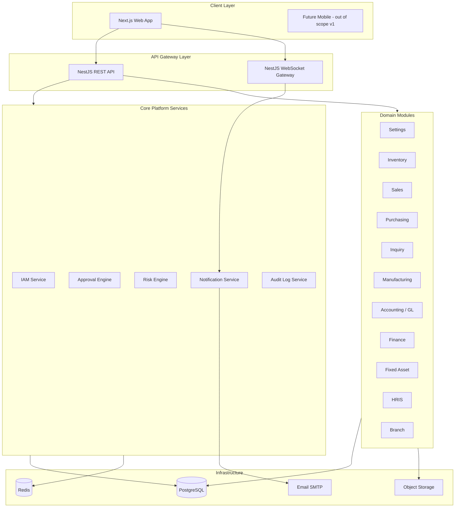
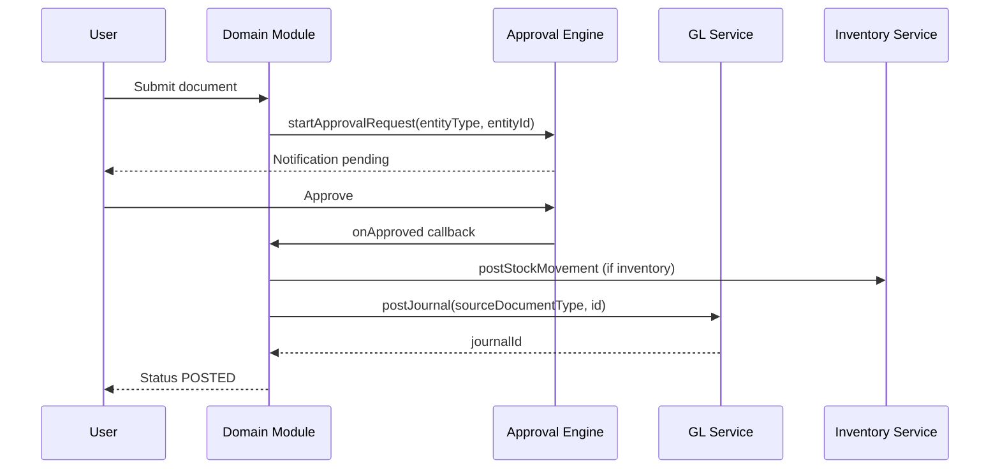

# 3. Arsitektur Sistem

## 3.1 Diagram high-level



---

## 3.2 Pola arsitektur

### Modular Monolith (NestJS)

Satu deployable backend dengan **bounded context** per modul NestJS:

```
apps/
  api/                    # NestJS application
packages/
  shared/                 # DTO, enums, utils
  database/               # Prisma client & migrations
```

Setiap domain module:

```
modules/<domain>/
  <domain>.module.ts
  controllers/
  services/
  dto/
  entities/               # Prisma types / domain models
  listeners/              # Event handlers
  guards/                 # Permission guards
```

**Alasan:** ERP membutuhkan transaksi DB cross-module (inventory → GL). Microservices prematur untuk v1.

### Event-driven internal

Gunakan **NestJS EventEmitter** atau **BullMQ** untuk:

- `inventory.receipt.posted` → trigger GL posting
- `approval.approved` → apply snapshot / activate entity
- `exchange-rate.approved` → update rate table
- `period.closed` → block posting

Idempotency key wajib untuk side-effect ke GL.

### CQRS light (opsional)

Query berat (ledger, stock card, aging) via **read-optimized views** atau materialized query — tanpa full CQRS infrastructure v1.

---

## 3.3 Frontend architecture (Next.js)

```
apps/
  web/                    # Next.js App Router
    app/
      (auth)/             # Login, forgot password
      (dashboard)/        # Layout authenticated
        setting/
        inventory/
        sales/
        ...
    components/           # Shared UI
    features/             # Feature hooks & API clients
    lib/                  # axios/fetch, auth
```

**Pola:**

- **Server Components** untuk halaman list/master data (SEO tidak prioritas; keuntungan = less client JS)
- **Client Components** untuk form interaktif, ERP table, workflow builder
- **React Query** untuk server state & cache invalidation
- **WebSocket hook** untuk notification realtime

Migrasi dari legacy: mapping `src/modules/*` → `app/(dashboard)/*` dengan struktur serupa.

---

## 3.4 Integrasi antar modul

### Pola transaksi ERP



### Source document linking

Setiap jurnal GL wajib punya:

- `sourceDocumentType` — enum (`SALES_INVOICE`, `PURCHASE_RECEIPT`, `INV_ISSUE`, …)
- `sourceDocumentId` — UUID dokumen sumber
- `idempotencyKey` — cegah double posting

### Subledger ↔ GL reconciliation

| Subledger | Akun GL | Reconciliation |
|-----------|---------|----------------|
| Inventory | Persediaan (asset) | Stock valuation vs GL balance |
| AR | Piutang | Open invoice vs AR account |
| AP | Utang | Open bill vs AP account |
| Fixed Asset | Aset tetap + akumulasi | NBV vs register |

---

## 3.5 Security architecture

| Layer | Mekanisme |
|-------|-----------|
| Authentication | JWT access (short) + refresh token (httpOnly cookie) |
| Authorization | RBAC: `permission` → `role` → `userOrgRole` per company |
| Data scope | Guard injects `companyId` dari header/session; query always filtered |
| Approval | `disallowSelfApproval`, org level rank, amount limit |
| Audit | Immutable `audit_logs` untuk CRUD master & posting |
| File upload | Signed URL / private storage; virus scan (fase 2) |

---

## 3.6 Deployment (SaaS single-tenant)

Satu **tenant** = satu instance deployment (atau satu namespace K8s):

```
Tenant A → actstrive-a.example.com → DB A, Redis A
Tenant B → actstrive-b.example.com → DB B, Redis B
```

**Bukan** shared DB multi-tenant. Skalabilitas horizontal per tenant.

Environment:

- `development`, `staging`, `production`
- Secrets: DB URL, JWT secret, SMTP, S3 credentials

---

## 3.7 API conventions

| Aspek | Konvensi |
|-------|----------|
| Base path | `/api/v1` |
| Auth header | `Authorization: Bearer <token>` |
| Company context | Header `X-Company-Id` |
| Pagination | `?page=1&limit=20&sort=createdAt:desc` |
| Filter | Query params typed; complex → POST `/search` |
| Response | `{ data, meta, errors? }` |
| Error | RFC 7807 Problem Details |
| Idempotency | Header `Idempotency-Key` untuk POST transaksi |

---

## 3.8 Real-time

WebSocket channel per user + broadcast per company:

```json
{
  "event": "notification.created",
  "companyId": "uuid",
  "targetEntityType": "EXCHANGE_RATE_REQUEST",
  "targetEntityId": "uuid",
  "payload": { ... }
}
```

Legacy lesson: sertakan `targetEntityId` agar client hanya refetch data relevan.
