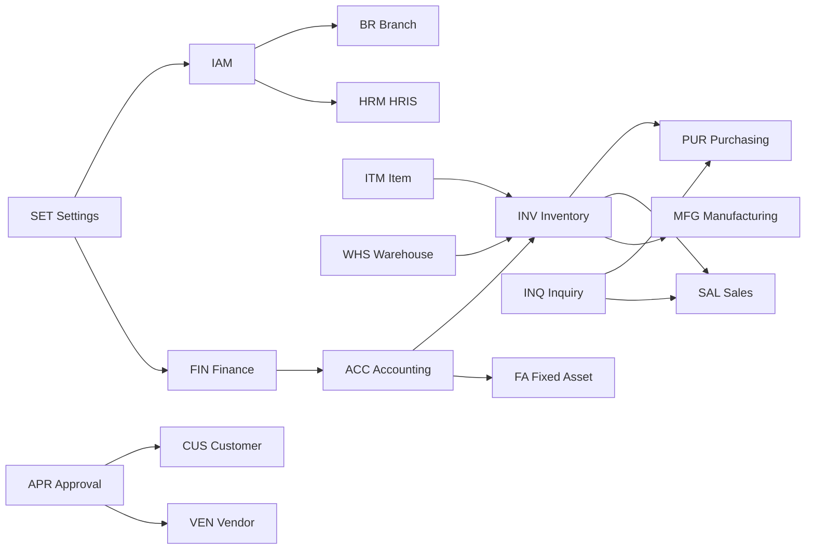

# 4. Katalog Modul

Katalog lengkap modul ACT Strive rebuild, dikelompokkan per domain.

**Legenda status warisan legacy:**

- ✅ Sudah ada (FE + BE sebagian besar)
- 🟡 Partial (desain/UI/schema saja)
- 🆕 Baru (belum ada di legacy)

---

## 4.1 Platform & governance

| Modul | Kode | Deskripsi | Legacy | Prioritas |
|-------|------|-----------|--------|-----------|
| **Settings (Umum)** | `SET` | Company group, company, company setting, country, number format, document header/footer | ✅ | P0 |
| **IAM** | `IAM` | User, role, permission, org role/level, unit, user-org-role, session | ✅ | P0 |
| **Cabang (Branch)** | `BR` | Multi company under group; switch context; branch-specific master | ✅ (as Company) | P0 |
| **Approval Engine** | `APR` | Workflow definition, steps, rules, request runtime, action log | ✅ | P0 |
| **Risk Engine** | `RSK` | Base risk, risk rule, risk factor, scoring → workflow branch | ✅ | P0 |
| **Notification** | `NTF` | In-app, email, WebSocket push | ✅ | P0 |
| **Audit Log** | `AUD` | Immutable trail CRUD & posting | 🆕 | P1 |
| **Document Management** | `DMS` | Upload, versioning, link ke customer/vendor/transaction | 🟡 | P1 |
| **Reporting Engine** | `RPT` | Report builder, export PDF/Excel, scheduled report | 🟡 | P1 |
| **Dashboard & Analytics** | `DSH` | KPI widgets per modul | 🟡 | P1 |

---

## 4.2 Keuangan & akuntansi

| Modul | Kode | Deskripsi | Legacy | Prioritas |
|-------|------|-----------|--------|-----------|
| **Finance Master** | `FIN` | Currency, exchange rate (+ change request approval), TOP/Term Payment | ✅ | P0 |
| **Accounting / GL** | `ACC` | COA hierarki, GL journal, period, period close, journal rule engine | ✅ | P0 |
| **Accounts Receivable** | `AR` | Piutang, invoice sales, payment allocation, aging | 🟡 (Invoice model) | P0 |
| **Accounts Payable** | `AP` | Utang, bill purchase, payment, aging | 🟡 | P0 |
| **Cash & Bank** | `CSH` | Kas/bank account, bank reconciliation | 🆕 | P1 |
| **Tax Management** | `TAX` | PPN, PPh, tax code, e-faktur integration (fase 2) | 🆕 | P2 |
| **Fixed Asset** | `FA` | Aset berwujud, tidak berwujud, prepaid, amortisasi, depresiasi, disposal | 🟡 FE | P1 |
| **Budgeting** | `BDG` | Budget vs actual per COA/cost center | 🆕 | P2 |
| **Consolidation** | `CON` | Laporan konsolidasi multi cabang | 🆕 | P2 |

---

## 4.3 Operasional & supply chain

| Modul | Kode | Deskripsi | Legacy | Prioritas |
|-------|------|-----------|--------|-----------|
| **Item Master** | `ITM` | SKU, UOM, category, costing method, industry extensions | 🟡 | P0 |
| **Inventory** | `INV` | Stock, receipt, issue, adjustment, transfer, opname, valuation | 🟡 | P0 |
| **Warehouse** | `WHS` | Warehouse, location, PIC, snapshot approval | ✅ | P0 |
| **Purchasing** | `PUR` | PR, PO, GRN, vendor bill | 🟡 | P0 |
| **Sales** | `SAL` | Quotation, SO, delivery, invoice | 🟡 | P0 |
| **Inquiry** | `INQ` | Inquiry → requirement → RFQ → quotation → customer PO (pengadaan barang & jasa) | 🟡 schema | P0 |
| **Manufacturing** | `MFG` | BOM multi-level, routing, work order, material issue, FG receipt, WIP | 🟡 desain | P1 |
| **Quality Control** | `QC` | Inspection, NCR, hold/release stock | 🆕 | P2 |
| **Logistics / Shipment** | `LOG` | Delivery order, tracking, packing list | 🟡 DO model | P1 |
| **Project / Job Costing** | `PRJ` | Project-based costing untuk jasa | 🆕 | P2 |

---

## 4.4 Master data mitra

| Modul | Kode | Deskripsi | Legacy | Prioritas |
|-------|------|-----------|--------|-----------|
| **Customer** | `CUS` | Master customer, bank, document, credit limit, snapshot approval | ✅ | P0 |
| **Vendor** | `VEN` | Master vendor, bank, tax, document, snapshot approval | ✅ | P0 |
| **Partner Portal** | `PPT` | Vendor/customer self-service (fase jauh) | 🆕 | P3 |

---

## 4.5 HRIS

| Modul | Kode | Deskripsi | Legacy | Prioritas |
|-------|------|-----------|--------|-----------|
| **Employee Master** | `HRM` | Data karyawan, department, position | 🟡 | P1 |
| **Organization** | `ORG` | Struktur org (integrasi Unit legacy) | ✅ partial | P1 |
| **Attendance** | `ATT` | Absensi, shift, overtime | 🆕 | P2 |
| **Leave Management** | `LV` | Cuti, approval cuti | 🆕 | P2 |
| **Payroll** | `PAY` | Payroll run, BPJS, PPh 21 | 🆕 | P3 |
| **Recruitment** | `REC` | Lowongan, applicant tracking | 🆕 | P3 |

---

## 4.6 Industry extensions

| Modul | Kode | Deskripsi | Legacy | Prioritas |
|-------|------|-----------|--------|-----------|
| **Industry Profile** | `IND` | Konfigurasi modul & field per industri | 🆕 | P0 |
| **Marine / IMPA Catalog** | `IMP` | Katalog IMPA, cross-reference item | 🆕 | P1 |
| **Aviation / ATA Catalog** | `ATA` | Katalog ATA chapter, airworthiness tag | 🆕 | P1 |
| **General Trading** | `GEN` | Default profile tanpa extension khusus | ✅ | P0 |

Detail: [`09-INDUSTRY_PROFILES.md`](./09-INDUSTRY_PROFILES.md).

---

## 4.7 Modul tambahan (rekomendasi)

Modul berikut **disarankan** untuk melengkapi ERP hybrid:

| Modul | Alasan |
|-------|--------|
| **Service Management** | Perusahaan jasa: service order, SLA, billing recurring |
| **Contract Management** | Kontrak customer/vendor, renewal, milestone billing |
| **Maintenance (CMMS)** | Untuk fixed asset & equipment industry — work request, PM schedule |
| **CRM Lite** | Lead, opportunity → quotation (integrasi sales) |
| **E-Procurement Portal** | RFQ online ke vendor terdaftar |
| **Barcode / RFID** | Scan GR/GI, mobile warehouse |
| **Inter-company Billing** | Transfer barang antar cabang + elimination |
| **Compliance & ISO** | Document control, audit checklist (legacy sudah referensi ISO 9001 di approval) |
| **API Integration Hub** | Webhook, REST connector ke sistem eksternal (accounting lokal, shipping) |
| **Backup & Data Export** | Tenant admin tools untuk SaaS single-tenant |

---

## 4.4 Dependency graph (implementasi)

---

## 4.5 Mapping modul → NestJS package

| NestJS Module | Submodule |
|---------------|-----------|
| `PlatformModule` | iam, settings, branch, notification, audit |
| `GovernanceModule` | approval, risk, workflow |
| `FinanceModule` | currency, exchange-rate, term-payment, cash-bank |
| `AccountingModule` | coa, gl-journal, period, journal-rule |
| `InventoryModule` | item, warehouse, stock, valuation |
| `ProcurementModule` | inquiry, rfq, quotation, purchase-order, grn |
| `SalesModule` | quotation, sales-order, delivery, invoice |
| `ManufacturingModule` | bom, routing, work-order |
| `AssetModule` | fixed-asset, depreciation, amortization |
| `HrModule` | employee, attendance, leave |
| `IndustryModule` | profile, impa, ata |

---

## 4.6 Mapping modul → Next.js routes

| Route prefix | Modul |
|--------------|-------|
| `/setting` | SET, IAM, APR, RSK |
| `/finance` | FIN |
| `/accounting` | ACC |
| `/inventory` | INV, ITM, WHS |
| `/purchasing` | PUR |
| `/sales` | SAL |
| `/inquiry` | INQ |
| `/manufacturing` | MFG |
| `/fixed-asset` | FA |
| `/hr` | HRM |
| `/dashboard` | DSH |
