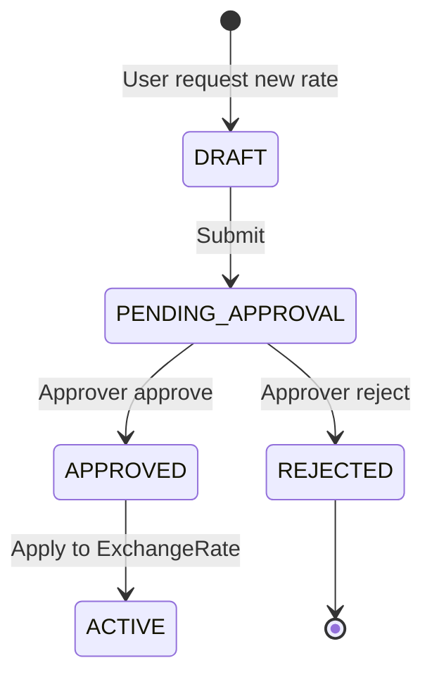

# 5. Multi-Currency dan Keuangan

Dokumen ini merinci desain **multi-currency** untuk transaksi operasional dan posting GL, dengan referensi legacy `GL_MULTICURRENCY_JOURNAL_SCHEMES.md`.

---

## 5.1 Konsep mata uang

| Konsep | Field / sumber | Deskripsi |
|--------|----------------|-----------|
| **Functional / Base currency** | `CompanySetting.baseCurrencyCode` | Mata uang pelaporan perusahaan (contoh: IDR) |
| **Transaction currency** | `currencyCode` per dokumen | Mata uang transaksi (USD, EUR, …) |
| **Allowed currencies** | `CompanyCurrency` | Daftar valas aktif per company |
| **Exchange rate** | `ExchangeRate` + histories | Kurs harian/bulanan per pasangan valas |
| **Rate policy** | Company setting | Tanggal kurs: transaksi / posting / period-end |

Legacy sudah mendukung:

- `allowMultiCurrency`, `allowManualRate` di `CompanySetting`
- `ExchangeRateChangeRequest` dengan approval
- `EmergencyOverrideExchangeRateLog`

---

## 5.2 Model data transaksi (pattern)

Setiap dokumen komersial dan baris GL mengikuti pola:

```typescript
// Document header (Sales Invoice, PO, Payment, …)
{
  currencyCode: 'USD',
  exchangeRateId: 'uuid',
  subtotal: 2000.00,        // transaction currency
  subtotalBase: 33000000,   // base currency
  taxAmount: ...,
  total: ...,
  totalBase: ...
}

// GL line (GlJournalLine)
{
  debitBase: 33000000,
  creditBase: 0,
  transactionCurrency: 'USD',
  debitTransaction: 2000,
  creditTransaction: 0,
  exchangeRateId: 'uuid'
}
```

**Validasi:** `baseCurrencyCode` header journal harus sama dengan company base.

---

## 5.3 Skenario jurnal multi-currency

Referensi lengkap legacy — ringkasan:

| # | Skenario | Trigger | Akun kunci |
|---|----------|---------|------------|
| 1 | Sales invoice USD | Invoice POSTED | AR (valas), Revenue |
| 2 | Purchase bill EUR | Bill POSTED | Inventory, AP (valas) |
| 3 | COGS recognition | Delivery POSTED | COGS, Inventory |
| 4 | AR payment + realized FX | Payment POSTED | Bank, AR, FX Gain/Loss |
| 5 | AP payment + realized FX | Payment POSTED | AP, Bank, FX Gain/Loss |
| 6 | Unrealized FX revaluation | Period-end job | AR/AP, Unrealized Gain/Loss |
| 7 | Inventory receipt valas | GR POSTED | Inventory (base from rate) |

Control accounts FX (legacy):

- Realized gain: `04.02.03` / code `7101-REALIZED-FX-GAIN`
- Realized loss: `05.05.02` / code `8101-REALIZED-FX-LOSS`

---

## 5.4 Exchange rate management

### Alur perubahan kurs



### Rate types

| Type | Penggunaan |
|------|------------|
| `SPOT` | Transaksi harian |
| `AVERAGE` | Costing bulanan |
| `BUDGET` | Perencanaan |
| `CLOSING` | Revaluation period-end |

### Emergency override

Log tersendiri (`EmergencyOverrideExchangeRateLog`) dengan dual approval — warisan legacy wajib dipertahankan untuk audit.

---

## 5.5 Term of Payment (TOP)

Legacy model `TermPayment` dengan:

- Early payment discount
- Penalty
- Accounting mapping (`TermAccounting`)

Integrasi ke: Customer PO, Purchase Order, Invoice.

---

## 5.6 Multi-currency di modul operasional

| Modul | Field valas | Rate timing |
|-------|-------------|-------------|
| Inquiry / RFQ | Optional (estimasi) | Reference only |
| Quotation | `currencyCode` wajib | Quote date |
| Customer PO | `currencyCode` wajib | PO date |
| Purchase Order | `currencyCode` wajib | PO date |
| Invoice | `currencyCode` wajib | Invoice date |
| Payment | `currencyCode` wajib | Payment date (realized FX) |
| Inventory receipt | Base from PO rate | GR date |
| Fixed asset acquisition | Acquisition currency | Capitalization date |

---

## 5.7 Rounding policy

| Aturan | Kebijakan default |
|--------|-------------------|
| Line rounding | Round per line 2 decimal txn currency |
| Base conversion | Round base to 0 decimal (IDR) |
| FX difference | Post selisih pembulatan ke akun rounding (materiality threshold) |
| Payment FX | Realized gain/loss on settlement |

---

## 5.8 Reporting

| Laporan | Currency view |
|---------|---------------|
| Trial Balance | Base only |
| GL Detail | Base + txn columns optional |
| AR/AP Aging | Txn + base columns |
| Open PO/SO | Txn currency |
| FX Gain/Loss | Base, period filter |

---

## 5.9 Implementasi NestJS

### Services

- `CurrencyService` — master currency
- `ExchangeRateService` — CRUD + approval integration
- `FxConversionService` — convert amount, resolve rate by date/policy
- `GlPostingService` — build balanced journal with txn trail
- `PeriodRevaluationJob` — scheduled unrealized FX

### Events

- `exchange-rate.approved` → invalidate cache, notify modules
- `payment.posted` → compute realized FX lines

---

## 5.10 Acceptance criteria

1. Invoice USD 2.000 @ 16.500 → AR base 33.000.000 IDR.
2. Payment @ 16.800 → realized gain 600.000 IDR otomatis.
3. Period-end revaluation AR valas dengan kurs closing.
4. Exchange rate change harus approval sebelum aktif (kecuali emergency override ter-log).
5. Semua laporan keuangan primary dalam base currency; drill-down tampilkan txn currency.
