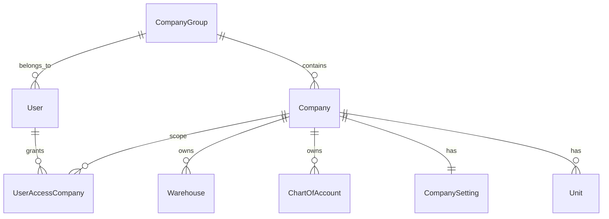

# 6. Multi Cabang dan Single-Tenant SaaS

---

## 6.1 Model tenancy

ACT Strive rebuild menggunakan **SaaS single-tenant**:

| Konsep | Implementasi |
|--------|--------------|
| **Tenant** | Satu deployment = satu `CompanyGroup` |
| **Cabang (Branch)** | `Company` di bawah group yang sama |
| **User** | Milik `CompanyGroup`; akses ke subset `Company` via `UserAccessCompany` |
| **Context aktif** | `currentCompanyId` pada session user |



**Bukan** multi-tenant shared database (row-level tenant_id untuk banyak klien dalam satu DB).

---

## 6.2 Hierarki organisasi per cabang

Legacy model (dipertahankan):

| Entity | Fungsi |
|--------|--------|
| `CompanyGroup` | Root tenant; default currency group |
| `Company` | Cabang/legal entity |
| `Unit` | Departemen/divisi dalam company |
| `OrgRole` | Role bisnis (Purchasing Manager, …) |
| `OrgLevel` | Rank 0–5 untuk eskalasi approval |
| `UserOrgRole` | Assignment user + role + unit + level |
| `UserHierarchy` | Supervisor chain |
| `DynamicActor` | Resolver approver dinamis (mis. "PIC Warehouse") |

---

## 6.3 Data scoping rules

### Selalu scoped by `companyId`

- Master: COA, warehouse, customer, vendor, item
- Transaksi: PO, SO, invoice, inventory movement, journal
- Workflow definition, risk rule
- Exchange rate (per company)

### Scoped by `companyGroupId`

- User account (email unique global per deployment)
- Company group settings

### Shared reference (global seed)

- `Country`, `Currency` (master list)
- IMPA / ATA catalog (read-only reference, bisa shared DB seed)

### Query guard (NestJS)

```typescript
// Pseudocode — every repository method
async findInvoices(dto: ListInvoiceDto, ctx: RequestContext) {
  return this.prisma.invoice.findMany({
    where: {
      companyId: ctx.companyId, // from X-Company-Id header
      ...dto.filters,
    },
  });
}
```

---

## 6.4 Switch cabang (branch context)

### UX flow

1. User login → default `currentCompanyId` (last used atau primary)
2. Header/topbar: dropdown cabang aktif
3. Switch cabang → update session + invalidate React Query cache
4. Permission check: user must have `UserAccessCompany` for target

### API

- `PATCH /api/v1/users/me/current-company` `{ companyId }`
- All subsequent requests: `X-Company-Id: <uuid>`

---

## 6.5 Master data: central vs per cabang

| Master | Strategi default | Override |
|--------|------------------|----------|
| Customer | Per company | Inter-company customer (fase 2) |
| Vendor | Per company | Shared vendor group (fase 2) |
| Item/SKU | Per company | Shared item catalog at group level (opsional) |
| COA | Per company | Template COA from group seed |
| Warehouse | Per company | — |
| Employee | Per company | Transfer antar cabang (fase 2) |

**Rekomendasi v1:** Semua master **per company** (cabang) untuk isolasi audit sederhana.

---

## 6.6 Transaksi antar cabang (inter-company)

Fase 2 — desain awal:

| Transaksi | Alur |
|-----------|------|
| Stock transfer | DO cabang A → GR cabang B + IC pricing |
| IC invoice | Auto invoice internal |
| Consolidation | Elimination entries saat laporan group |

v1: **Transfer stock** antar warehouse ** dalam company yang sama** saja. Antar company = manual PO/SO.

---

## 6.7 Numbering sequence

Nomor dokumen unique per company (legacy pattern):

```prisma
@@unique([companyId, number])
```

Format nomor configurable per company:

- `PO-{BRANCH}-{YYYYMM}-{SEQ}`
- Sequence table per `documentType` + `companyId` + optional `fiscalYear`

---

## 6.8 Deployment single-tenant

### Infrastruktur per tenant

```yaml
# contoh docker-compose per tenant
services:
  api:
    environment:
      TENANT_ID: acme-corp
      DATABASE_URL: postgres://...
  web:
    environment:
      NEXT_PUBLIC_API_URL: https://acme.actstrive.app/api
  postgres:
    volumes:
      - acme_pg_data:/var/lib/postgresql/data
  redis:
    ...
```

### Provisioning checklist

1. Create `CompanyGroup` + initial `Company` (HQ)
2. Seed COA template, currency, country
3. Create super admin user
4. Configure industry profile
5. Activate modules

---

## 6.9 Konsolidasi laporan multi cabang

| Laporan | v1 | v2 |
|---------|----|----|
| Per cabang | ✅ | ✅ |
| Combined trial balance | Export manual | Auto consolidation |
| Elimination | ❌ | ✅ |
| Management dashboard | Sum KPI all accessible companies | Group-level role |

User dengan akses multi-company dapat melihat **aggregated dashboard** (read-only sum) di v1.

---

## 6.10 Acceptance criteria

1. Dua cabang under one group; user A hanya akses cabang 1; user B akses keduanya.
2. PO cabang 1 tidak visible di query cabang 2.
3. Switch cabang tanpa re-login.
4. Nomor dokumen tidak bentrok antar cabang.
5. COA dan warehouse terisolasi per cabang.
