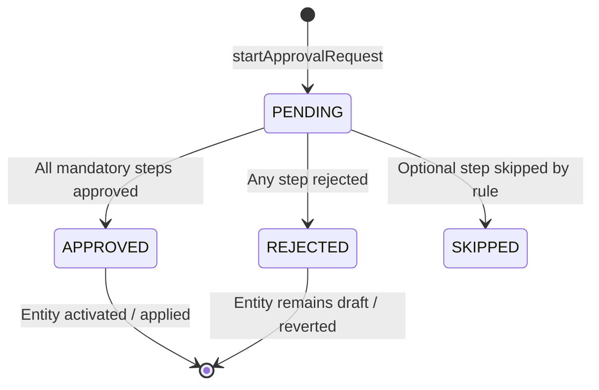
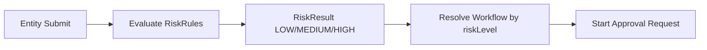

# 7. Approval Engine dan Risk Engine

Referensi legacy: `act-strive-api/docs/APPROVAL_FLOW.md`, modul `approvalEngine`, `workflowDefinition`, `risk*`.

---

## 7.1 Arsitektur approval

### Engine baru (primary)

```
workflow_definitions
        |
        +── workflow_steps      (SELALU ADA, min 1 step)
        |
        +── workflow_rules      (HANYA jika workflow_mode = RULE_BASED)

Runtime:
approval_requests → approval_request_steps → approval_action_logs
```

### Legacy (deprecate)

`Approval` template/instance — fallback sementara selama migrasi; **tidak** dikembangkan fitur baru.

---

## 7.2 Workflow definition

| Field | Deskripsi |
|-------|-----------|
| `entityType` | Enum: `CHART_OF_ACCOUNT`, `VENDOR`, `CUSTOMER`, `EXCHANGE_RATE`, `WAREHOUSE`, … |
| `trigger` | `CREATE`, `SUBMIT`, `UPDATE`, `DEACTIVATE`, `REACTIVATE`, `ARCHIVE` |
| `workflowMode` | `STEP_ONLY` \| `RULE_BASED` |
| `priority` | Resolver: ascending |
| `isDefault` | Fallback jika tidak ada rule match |
| `disallowSelfApproval` | Cegah self-approve |
| `version` | Versioning definisi |

### Workflow step

| Field | Deskripsi |
|-------|-----------|
| `sequence` | Urutan step |
| `actorType` | `ROLE` \| `USER` \| `DYNAMIC` |
| `roleCode` / `userId` / `dynamicActorCode` | Target approver |
| `mandatory` | Tidak bisa skip |
| `slaDays` | Deadline eskalasi |
| `conditionExpr` | JSON Logic opsional per step |

### Workflow rule (RULE_BASED)

| Field | Deskripsi |
|-------|-----------|
| `ruleType` | `RISK_LEVEL`, `AMOUNT_THRESHOLD`, `FIELD_MATCH`, … |
| `ruleExpression` | JSON Logic |
| `resultStepOrder` | Mulai approval dari step ke-N jika match |
| `priority` | Urutan evaluasi rule |

---

## 7.3 Resolver workflow

Algoritma (port dari legacy `resolveWorkflowDefinition`):

1. Filter by `entityType` + `companyId` + `trigger`
2. Jika `riskLevel` tersedia → cari RULE_BASED dengan rule match
3. Jika tidak match → cari STEP_ONLY (tanpa rules)
4. Sort by `priority` asc, prefer `isDefault`

---

## 7.4 Runtime approval request

### Lifecycle



### Step status

`PENDING` → `APPROVED` | `REJECTED` | `SKIPPED`

Setiap aksi → `approval_action_logs` (immutable):

- `action`: APPROVE, REJECT, ESCALATE, DELEGATE, COMMENT
- `performedBy`, `performedAt`, `note`, `payload`

---

## 7.5 Integrasi entity

### Snapshot pattern (Customer, Vendor, Warehouse, COA)

1. User edit → create `*Snapshot` status DRAFT
2. Submit → `startApprovalRequest(snapshotId, entityType)`
3. Approved → apply snapshot to master; master version++
4. Rejected → snapshot REJECTED; master unchanged

### Direct entity (Exchange Rate Request)

Submit request → approval → on approve apply rate to `ExchangeRate` table.

### Posting documents (future)

Threshold-based: adjustment inventory > X → approval before POSTED.

---

## 7.6 Risk engine

### Komponen

| Entity | Fungsi |
|--------|--------|
| `BaseRisk` | Template risiko per entity type |
| `RiskRule` | Rule evaluasi → output risk level |
| `RiskFactor` | Faktor input (amount, country, payment term, …) |
| `RiskResult` | Hasil evaluasi per submission |
| `RiskResultDetail` | Breakdown per factor |

### Flow



### JSON Logic

Legacy menggunakan `json-logic-js` untuk:

- Workflow rule expression
- Risk rule expression
- Step condition expression

Rebuild: pertahankan JSON Logic; FE workflow builder port ke Next.js.

---

## 7.7 Dynamic actor

Resolver approver non-statis:

| Code | Resolver |
|------|----------|
| `WAREHOUSE_PIC` | `Warehouse.picUserId` |
| `REQUESTOR_SUPERVISOR` | `UserHierarchy.supervisor` |
| `CUSTOM_FIELD` | Configurable via DynamicActor table |

Service: `DynamicActorResolverService.resolve(code, context)`.

---

## 7.8 Eskalasi & SLA

| Kondisi | Aksi |
|---------|------|
| Step pending > slaDays | Notify + escalate to next org level |
| No approver at level | Auto-skip or escalate per config |
| Approver inactive | Reassign to acting role |

Background job: `ApprovalSlaJob` (cron hourly).

Legacy todo: step-only workflow skip risk → langsung ke step (implementasi rebuild).

---

## 7.9 Notification integration

On approval events:

- Create `Notification` record
- WebSocket push dengan `targetEntityType` + `targetEntityId`
- Email optional per user preference

Legacy lesson: saat user org role baru dibuat, scan pending approvals untuk role tersebut.

---

## 7.10 NestJS module design

```
modules/governance/
  approval/
    approval.module.ts
    approval-engine.service.ts
    workflow-definition.service.ts
    approval.controller.ts
  risk/
    risk-evaluation.service.ts
    risk.controller.ts
  workflow/
    workflow-builder.controller.ts
```

### Guards

- `ApprovalPermissionGuard` — user can act on current step
- `EntityApprovalStateGuard` — block edit while PENDING

---

## 7.11 Entity types (registry)

| entityType | Modul | Trigger umum |
|------------|-------|--------------|
| `CHART_OF_ACCOUNT` | ACC | CREATE, UPDATE |
| `VENDOR` | VEN | CREATE, UPDATE, DEACTIVATE |
| `CUSTOMER` | CUS | CREATE, UPDATE |
| `EXCHANGE_RATE` | FIN | CREATE (change request) |
| `WAREHOUSE` | WHS | CREATE, UPDATE |
| `CUSTOMER_BANK` | CUS | CREATE, UPDATE |
| `VENDOR_BANK` | VEN | CREATE, UPDATE |
| `INVENTORY_ADJUSTMENT` | INV | SUBMIT (threshold) |
| `PURCHASE_ORDER` | PUR | SUBMIT (amount) |
| `JOURNAL_MANUAL` | ACC | SUBMIT |

Registry extensible via enum + plugin registration.

---

## 7.12 Acceptance criteria

1. Workflow RULE_BASED: HIGH risk → 3 step; LOW risk → 1 step.
2. Self-approval blocked when `disallowSelfApproval = true`.
3. Full audit trail in `approval_action_logs`.
4. Reject returns entity to editable draft.
5. New user assigned role receives pending approval notifications.
6. WebSocket hanya reload entity yang `targetEntityId`-nya match.
