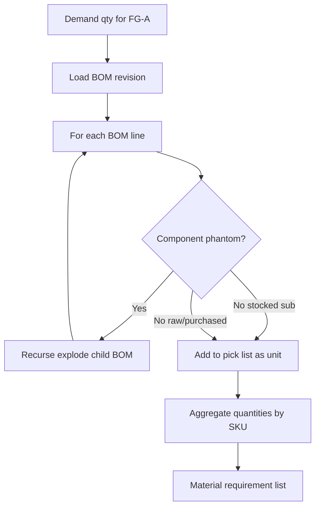
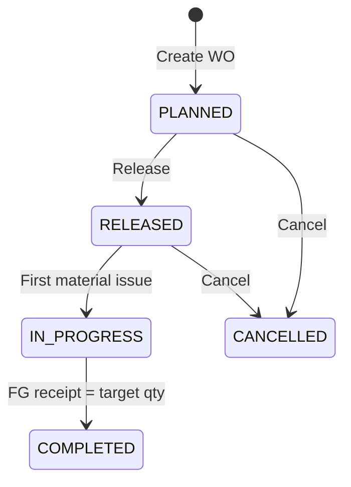

# 8. Manufacturing — BOM Multi-Level

Referensi legacy: `MANUFACTURING_BOM_DESIGN.md`, `MANUFACTURING_BOM_PRODUCT_DECISIONS.md`, `INVENTORY_BASE_SPRINT_PLAN.md` (EPIC F).

---

## 8.1 Scope manufacturing

| Fitur | v1 (P1) | v2 (P2) |
|-------|---------|---------|
| Item flags (raw, FG, phantom, stocked sub) | ✅ | ✅ |
| BOM header + lines | ✅ single/multi level | ✅ |
| BOM revision & effective date | ✅ | ✅ |
| Cycle detection | ✅ | ✅ |
| Work order | ✅ basic | ✅ full |
| Material issue | ✅ | ✅ |
| FG / sub-assembly receipt | ✅ | ✅ |
| Explode phantom | ✅ | ✅ |
| WIP account | ❌ simplified posting | ✅ full WIP |
| Routing / operation | ❌ | ✅ |
| Overhead & variance | ❌ | ✅ |
| MRP | ❌ | 🔄 evaluate |

---

## 8.2 Taksonomi item

| Tipe | `itemType` | Stok | Contoh |
|------|------------|------|--------|
| Raw material | `RAW` | Ya | Baja, resin |
| Purchased part | `PURCHASED` | Ya | Bolt, bearing |
| Sub-assembly stocked | `SUB_ASSEMBLY` | Ya (default) | Modul mesin |
| Sub-assembly phantom | `PHANTOM` | Tidak | Struktur perencanaan |
| Finished good | `FINISHED_GOOD` | Ya | Produk jadi |
| Service | `SERVICE` | Tidak | Jasa instalasi |

**Keputusan produk legacy (dipertahankan):**

- Default sub-assembly baru = **stocked** (`phantom = false`)
- Phantom diaktifkan **eksplisit** per SKU

---

## 8.3 Model data

### BOM Header

```prisma
model BomHeader {
  id            String   @id @default(uuid())
  companyId     String
  itemId        String   // parent SKU (FG or sub-assembly)
  revision      String
  effectiveFrom DateTime
  effectiveTo   DateTime?
  status        BomStatus // DRAFT, ACTIVE, OBSOLETE
  lines         BomLine[]
  ...
}

model BomLine {
  id           String  @id @default(uuid())
  bomHeaderId  String
  componentId  String  // child item
  quantity     Decimal
  uomId        String
  scrapPercent Decimal @default(0)
  sequence     Int
  ...
}
```

### Work Order

```prisma
model WorkOrder {
  id            String   @id @default(uuid())
  companyId     String
  number        String
  itemId        String   // FG to produce
  bomHeaderId   String   // pinned revision
  quantity      Decimal
  status        WoStatus // PLANNED, RELEASED, IN_PROGRESS, COMPLETED, CANCELLED
  warehouseId   String   // receipt target
  ...
}
```

---

## 8.4 BOM multi-level explode

### Graf BOM

```
FG-A (finished)
├── SUB-B (stocked sub-assembly)
│   ├── RAW-1
│   └── RAW-2
└── RAW-3
```

### Explode algorithm



**Validasi:**

- Deteksi siklus (DFS) saat save BOM
- Max depth configurable (default 10 level)
- UOM conversion via `UomConversion` table

### Issue policy (legacy default)

| Komponen | Perilaku |
|----------|----------|
| Phantom | Explode ke anak; tidak kurangi saldo phantom |
| Stocked sub-assembly | Issue sebagai **satu unit** (kurangi stok SUB-B) |
| Raw / purchased | Issue langsung |

Opsi fase 2: `forceExplode` flag per WO line untuk stocked sub.

---

## 8.5 Work order lifecycle



### Transaksi inventory per WO

| Step | Inventory txn | GL (v1 simplified) |
|------|---------------|-------------------|
| Material issue | ISSUE (components) | Dr COGS/WIP-contra, Cr Inventory |
| FG receipt | RECEIPT (FG) | Dr Inventory FG, Cr COGS/WIP-contra |
| Scrap | ADJUSTMENT minus | Dr Scrap expense, Cr Inventory |

v1 **tanpa WIP eksplisit**: direct material → FG jika BOM depth ≤ 2 dan disetujui finance.

v2: WIP account + overhead allocation.

---

## 8.6 Integrasi modul lain

| Modul | Integrasi |
|-------|-----------|
| Inventory | Issue/receipt stock movements |
| Purchasing | MRP suggestion → PR (v2) |
| Sales | MTO: SO line → WO create |
| Costing | Moving average / standard cost update on FG receipt |
| GL | Journal via `sourceDocumentType = WORK_ORDER` |
| Approval | WO release above threshold |

---

## 8.7 Costing

| Method | Legacy support | Manufacturing use |
|--------|----------------|-------------------|
| `MOVING_AVERAGE` | ✅ planned | Default v1 |
| `FIFO` | ✅ planned | Optional |
| `STANDARD_COST` | ✅ planned | FG with variance (v2) |

FG receipt cost (v1 average):

```
unitCost = (materialIssueCost + allocatedLabor + allocatedOverhead) / receiptQty
```

v1: material cost only.

---

## 8.8 UI (Next.js)

| Halaman | Fungsi |
|---------|--------|
| `/manufacturing/bom` | List BOM per item |
| `/manufacturing/bom/:id` | BOM editor (tree view multi-level) |
| `/manufacturing/work-orders` | WO list |
| `/manufacturing/work-orders/:id` | WO detail: materials, issue, receipt |
| `/manufacturing/explosion` | Where-used / explosion preview |

Port Gantt dari legacy (`@wamra/gantt-task-react`) untuk WO scheduling (opsional v2).

---

## 8.9 Dependency

Manufacturing **bergantung** pada:

1. ✅ Inventory base P0 (receipt, issue, adjustment)
2. ✅ Item master with types
3. ✅ GL posting adapter
4. ✅ Warehouse locations

Implementasi setelah **inventory base GO** (legacy exit gate).

---

## 8.10 Acceptance criteria

1. BOM 4 level tanpa siklus; save ditolak jika ada cycle.
2. WO explode phantom sub; pick list hanya raw parts.
3. Stocked sub-assembly issued as single SKU; stok berkurang benar.
4. FG receipt increases stock; unit cost calculated.
5. WO pins BOM revision; perubahan BOM tidak alter WO released.
6. GL journal balanced; `sourceDocumentId` = WO id.
