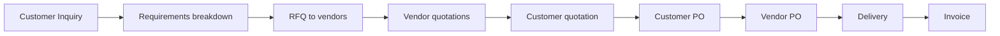

# 9. Profil Industri — General, Manufaktur, Marine, Aviasi

ERP hybrid mengaktifkan fitur dan extension field berdasarkan **Industry Profile** per `CompanyGroup` atau `Company`.

---

## 9.1 Konsep Industry Profile

```typescript
enum IndustryProfile {
  GENERAL = 'GENERAL',
  MANUFACTURING = 'MANUFACTURING',
  MARINE = 'MARINE',
  AVIATION = 'AVIATION',
}

interface IndustryConfig {
  profile: IndustryProfile;
  enabledModules: string[];      // module codes from MODULE_CATALOG
  itemExtensions: FieldDefinition[];
  documentTemplates: string[];
  catalogType?: 'IMPA' | 'ATA' | null;
  complianceFlags: Record<string, boolean>;
}
```

Profile disimpan di `CompanySetting` atau `CompanyGroup` level; cabang bisa override opsional.

---

## 9.2 Matriks modul per industri

| Modul | General | Manufacturing | Marine | Aviation |
|-------|---------|---------------|--------|----------|
| Inventory | ✅ | ✅ | ✅ | ✅ |
| Sales / Purchase | ✅ | ✅ | ✅ | ✅ |
| Inquiry | ✅ | ○ | ✅ | ✅ |
| Manufacturing | ○ | ✅ | ○ | ○ |
| IMPA Catalog | ❌ | ❌ | ✅ | ○ |
| ATA Catalog | ❌ | ❌ | ○ | ✅ |
| Fixed Asset | ✅ | ✅ | ✅ | ✅ |
| HRIS | ✅ | ✅ | ✅ | ✅ |
| QC / Inspection | ○ | ✅ | ✅ | ✅ |
| Serial / Batch trace | ○ | ✅ | ✅ | ✅ |

○ = optional activate

---

## 9.3 General (trading & jasa)

### Karakteristik

- Trading: buy-sell tanpa produksi
- Jasa: project-based billing (fase 2)
- Tidak butuh BOM/WO default

### Extension field item

| Field | Wajib |
|-------|-------|
| SKU, name, UOM | ✅ |
| Category | ✅ |
| Barcode | ○ |

### Dokumen

- Standard PO, SO, Invoice
- TOP domestic/international

---

## 9.4 Manufacturing

### Karakteristik

- BOM multi-level, work order
- Raw material → FG
- Costing: average / standard

### Extension field item

| Field | Deskripsi |
|-------|-----------|
| `itemType` | RAW, SUB_ASSEMBLY, FG, PHANTOM |
| `phantom` | Boolean |
| `leadTimeDays` | Procurement/production |
| `safetyStock` | Reorder planning |
| `standardCost` | For variance |

### Modul aktif default

`MFG`, `INV`, `PUR`, `SAL`, `ACC`, `QC` (optional)

---

## 9.5 Marine — IMPA

### Konteks bisnis

Perusahaan **pengadaan barang dan jasa** untuk industri maritim:

- Spare parts kapal dengan kode **IMPA** (International Marine Purchasing Association)
- Inquiry-heavy workflow: customer request → sourcing → quotation → PO vendor → delivery

### IMPA catalog integration

```prisma
model ImpaCatalogItem {
  impaCode      String   @id  // 6 digit IMPA
  description   String
  unit          String
  category      String
  ...
}

model ItemImpaMapping {
  itemId        String
  impaCode      String
  isPrimary     Boolean
  ...
}
```

### Fitur khusus

| Fitur | Deskripsi |
|-------|-----------|
| IMPA search | Autocomplete by code / description |
| Cross-reference | Multiple vendor part no → one IMPA |
| Vessel info | Optional field on inquiry (vessel name, IMO) |
| Certificate | CoC, mill cert attachment on delivery |
| Urgent flag | Priority routing on inquiry |

### Inquiry flow (marine)



Modul **Inquiry** menjadi **primary entry** untuk marine profile.

### Field extension — Inquiry

| Field | Contoh |
|-------|--------|
| `vesselName` | MV PACIFIC STAR |
| `imoNumber` | 9123456 |
| `portOfDelivery` | Tanjung Priok |
| `urgency` | NORMAL, URGENT, AOG-equivalent marine |

---

## 9.6 Aviation — ATA

### Konteks bisnis

Pengadaan suku cadang pesawat dengan klasifikasi **ATA 100** (Air Transport Association chapter system).

### ATA catalog integration

```prisma
model AtaCatalogItem {
  ataChapter    String   // e.g. "32-40"
  description   String
  ...
}

model ItemAtaMapping {
  itemId        String
  ataChapter    String
  ...
}
```

### Fitur khusus

| Fitur | Deskripsi |
|-------|-----------|
| ATA chapter browse | Tree by chapter (21, 22, … 80) |
| Traceability | Serial number, batch, life-limited part |
| Certification | FAA/EASA Form 1, dual release |
| Condition code | NEW, OH, SV, AR |
| Shelf life | Expiry tracking on inventory |

### Field extension — Item (aviation)

| Field | Deskripsi |
|-------|-----------|
| `serialNumber` | Unique per unit |
| `batchNumber` | Lot trace |
| `conditionCode` | NEW, OH, SV, AR |
| `certificateType` | FORM_1, COFC, … |
| `shelfLifeExpiry` | Date |
| `lifeLimitedPart` | Boolean + cycles/hours |

### Compliance

- **Blocked stock**: quarantine until inspection approved
- **Non-conforming part**: NCR workflow (integrasi QC module)
- Audit trail wajib untuk regulasi aviation authority

---

## 9.7 Implementasi teknis

### Plugin architecture (NestJS)

```
modules/industry/
  industry.module.ts
  profiles/
    general.profile.ts
    manufacturing.profile.ts
    marine.profile.ts
    aviation.profile.ts
  catalogs/
    impa.service.ts
    ata.service.ts
```

### Dynamic form (Next.js)

Industry profile → JSON schema → render additional fields on item/inquiry forms.

### Seed data

- IMPA catalog: import CSV/API (periodic update)
- ATA chapter tree: seed static reference

---

## 9.8 Migrasi dari legacy

Legacy **belum** punya IMPA/ATA — modul baru. Namun:

- Inquiry → RFQ → Quotation chain **sudah ada** di Prisma
- Multi-currency quotation **sudah ada**
- Approval vendor/customer **sudah ada**

Rebuild tinggal menambah catalog layer + industry-specific UI fields.

---

## 9.9 Acceptance criteria

1. Company profile MARINE: inquiry form shows vessel fields; IMPA search works.
2. Company profile AVIATION: item requires serial on receipt; blocked until QC pass.
3. Company profile MANUFACTURING: BOM menu visible; marine-specific fields hidden.
4. Company profile GENERAL: minimal form; no IMPA/ATA/BOM.
5. Switch profile affects menu visibility without code deploy.
