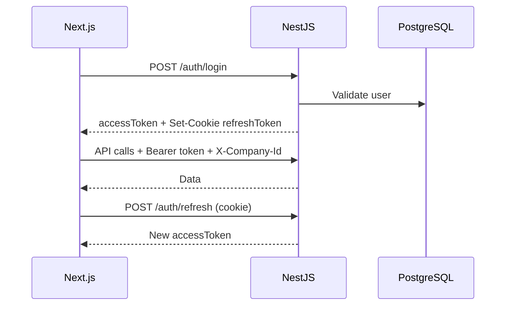

# 10. Tech Stack dan Struktur Proyek

---

## 10.1 Stack teknologi

### Backend

| Layer | Teknologi | Versi target |
|-------|-----------|--------------|
| Runtime | Node.js | 22 LTS |
| Framework | NestJS | 11.x |
| Language | TypeScript | 5.x |
| ORM | Prisma | 7.x |
| Database | PostgreSQL | 16+ |
| Cache / Queue | Redis + BullMQ | 7.x |
| Auth | @nestjs/passport + JWT | — |
| Validation | class-validator + class-transformer | — |
| API docs | Swagger (@nestjs/swagger) | — |
| WebSocket | @nestjs/websockets | — |
| Email | nodemailer | — |
| File storage | Local / S3-compatible | — |
| Testing | Jest + supertest | — |

### Frontend

| Layer | Teknologi | Versi target |
|-------|-----------|--------------|
| Framework | Next.js (App Router) | 15.x |
| Language | TypeScript | 5.x |
| UI Library | Ant Design | 6.x |
| Styling | Tailwind CSS | 4.x |
| Server state | TanStack React Query | 5.x |
| Client state | Zustand (minimal) | — |
| Forms | React Hook Form + Zod | — |
| Tables | Ant Design Table + custom ERP table port | — |
| Charts | Ant Design Charts / Recharts | — |
| PDF | @react-pdf/renderer or jsPDF | — |
| Real-time | native WebSocket client | — |

### DevOps

| Tool | Use |
|------|-----|
| pnpm workspaces | Monorepo |
| Docker Compose | Local dev |
| GitHub Actions | CI/CD |
| Turborepo (optional) | Build cache |

---

## 10.2 Monorepo structure

```
actstrive/
├── apps/
│   ├── api/                          # NestJS backend
│   │   ├── src/
│   │   │   ├── main.ts
│   │   │   ├── app.module.ts
│   │   │   ├── common/               # Guards, filters, interceptors
│   │   │   ├── config/
│   │   │   └── modules/              # Domain modules
│   │   ├── test/
│   │   └── nest-cli.json
│   │
│   └── web/                          # Next.js frontend
│       ├── app/
│       │   ├── (auth)/
│       │   ├── (dashboard)/
│       │   └── layout.tsx
│       ├── components/
│       ├── features/
│       └── lib/
│
├── packages/
│   ├── database/                     # Prisma schema & client
│   │   ├── prisma/
│   │   │   ├── schema.prisma
│   │   │   ├── migrations/
│   │   │   └── seed/
│   │   └── src/index.ts
│   │
│   ├── shared/                       # Shared types, enums, constants
│   │   └── src/
│   │       ├── enums/
│   │       ├── dto/
│   │       └── utils/
│   │
│   └── ui/                           # Shared UI components (optional)
│
├── docs/                             # Dokumentasi perencanaan (repo ini)
├── docker-compose.yml
├── pnpm-workspace.yaml
├── turbo.json
└── README.md
```

---

## 10.3 NestJS module structure (contoh)

```
apps/api/src/modules/inventory/
├── inventory.module.ts
├── controllers/
│   ├── item.controller.ts
│   ├── stock.controller.ts
│   └── warehouse.controller.ts
├── services/
│   ├── item.service.ts
│   ├── stock-movement.service.ts
│   ├── costing.service.ts
│   └── inventory-gl.adapter.ts
├── dto/
├── listeners/
│   └── on-approval-approved.listener.ts
└── inventory.permissions.ts
```

### Cross-cutting

```
apps/api/src/common/
├── guards/
│   ├── jwt-auth.guard.ts
│   ├── permission.guard.ts
│   └── company-context.guard.ts
├── interceptors/
│   └── audit-log.interceptor.ts
├── filters/
│   └── problem-details.filter.ts
└── decorators/
    ├── current-user.decorator.ts
    └── company-id.decorator.ts
```

---

## 10.4 Next.js structure (contoh)

```
apps/web/app/(dashboard)/inventory/
├── layout.tsx
├── items/
│   ├── page.tsx                 # Server component list
│   └── [id]/
│       └── page.tsx
├── warehouses/
│   └── page.tsx
└── movements/
    ├── receipt/
    └── issue/
```

```
apps/web/features/inventory/
├── api/                         # React Query hooks
├── components/
└── types/
```

---

## 10.5 Database strategy

### Migrasi dari legacy schema

1. Copy `schema.prisma` legacy sebagai baseline
2. Refactor: tambah model manufacturing, fixed asset, HRIS, industry catalogs
3. Rename/normalize jika perlu (backward compatible views fase migrasi data)
4. Seed: country, currency, COA template, IMPA/ATA reference

### Prisma conventions

- `@@map("snake_case_table")`
- `@map("snake_case_column")` for camelCase fields
- UUID primary keys
- Soft delete via `deletedAt` where needed (not universal)

---

## 10.6 API versioning & shared types

- Generate OpenAPI from NestJS Swagger
- Optional: generate TS client for FE from OpenAPI (`openapi-typescript`)
- Shared enums in `packages/shared` — single source of truth

---

## 10.7 Auth flow



Next.js middleware: protect `(dashboard)` routes; redirect unauthenticated to login.

---

## 10.8 Coding conventions

| Aspek | Konvensi |
|-------|----------|
| File naming | kebab-case |
| Class naming | PascalCase |
| API routes | plural nouns `/api/v1/items` |
| DTO | `CreateItemDto`, `UpdateItemDto`, `ListItemQueryDto` |
| Permissions | `inventory.item.create`, `inventory.item.view` |
| Git branches | `feat/`, `fix/`, `docs/` |
| Commits | Conventional Commits |

---

## 10.9 Legacy → new mapping

| Legacy | New |
|--------|-----|
| `act-strive-api/src/modules/*` | `apps/api/src/modules/*` |
| `act-strive/src/modules/*` | `apps/web/app/(dashboard)/*` |
| `act-strive/src/components/erp-table` | `apps/web/components/erp-table` |
| `act-strive-api/prisma/` | `packages/database/prisma/` |
| Express routes | NestJS controllers |
| Manual WS | NestJS Gateway |

---

## 10.10 Environment variables

### API

```env
DATABASE_URL=
REDIS_URL=
JWT_SECRET=
JWT_EXPIRES_IN=15m
REFRESH_TOKEN_EXPIRES_IN=7d
SMTP_HOST=
S3_BUCKET=
TENANT_ID=
```

### Web

```env
NEXT_PUBLIC_API_URL=
NEXT_PUBLIC_WS_URL=
```
