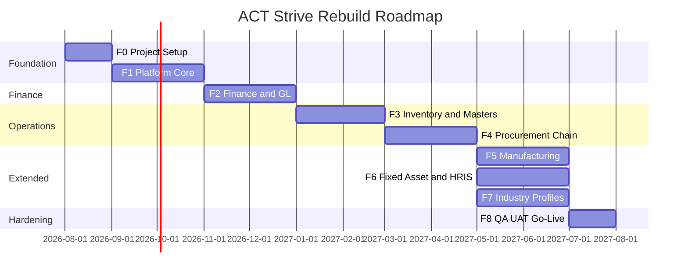

# 11. Roadmap Implementasi

Roadmap rebuild ACT Strive berdasarkan analisis legacy, dependency modul, dan prioritas bisnis.

**Estimasi total:** ~9–12 bulan (tim 4–6 engineer). Estimasi per fase relatif; sesuaikan dengan velocity tim.

---

## 11.1 Overview fase

---

## 11.2 F0 — Project setup (4 minggu)

### Deliverables

- [ ] Monorepo pnpm (apps/api, apps/web, packages/database, packages/shared)
- [ ] NestJS skeleton + health check
- [ ] Next.js skeleton + auth layout
- [ ] Docker Compose (postgres, redis)
- [ ] CI pipeline (lint, test, build)
- [ ] Prisma migrate baseline from legacy schema (trim + organize)
- [ ] Dokumentasi dev setup

### Exit criteria

- `pnpm dev` runs API + Web locally
- Swagger `/api/docs` accessible
- Login page renders (mock or real)

---

## 11.3 F1 — Platform core (8 minggu)

### Scope

| Modul | Fitur |
|-------|-------|
| IAM | Login, refresh token, user CRUD, UserAccessCompany |
| Settings | CompanyGroup, Company, CompanySetting, Country |
| Branch | Company switch, X-Company-Id guard |
| IAM extended | OrgRole, OrgLevel, Unit, UserOrgRole, DynamicActor |
| Approval | Workflow definition CRUD, engine port, action log |
| Risk | BaseRisk, RiskRule, RiskFactor, evaluation service |
| Notification | In-app + WebSocket + email stub |

### Legacy port priority

1. `approvalEngine.service.ts` → NestJS service
2. `workflowDefinition` module
3. `auth` + `user` modules
4. WebSocket gateway

### Exit criteria

- User login → switch cabang → CRUD company
- Create workflow for VENDOR → submit vendor → approve → active
- Risk level determines workflow branch
- Notification realtime received on approval

---

## 11.4 F2 — Finance & accounting (8 minggu)

### Scope

| Modul | Fitur |
|-------|-------|
| Finance | Currency, ExchangeRate, change request + approval |
| TOP | TermPayment + discount/penalty |
| COA | Hierarki 5 level, snapshot approval |
| GL | GlJournalHeader/Line, posting validation |
| Period | AccountingPeriod state machine, soft/hard close |
| Journal Rule | JournalRuleDefinition + engine (auto-posting hooks) |

### Referensi legacy docs

- `COA_GUIDE.md`, `GL_JOURNAL_API.md`, `GL_MULTICURRENCY_JOURNAL_SCHEMES.md`
- `JOURNAL_PERIOD_STATE_MACHINE.md`

### Exit criteria

- COA tree CRUD with approval
- Manual balanced journal posted
- Multi-currency invoice journal scheme #1 and #4 from doc
- Exchange rate change with approval flow
- Period close blocks posting

---

## 11.5 F3 — Inventory & masters (8 minggu)

### Scope

| Modul | Fitur |
|-------|-------|
| Customer | Master + bank + document + snapshot approval |
| Vendor | Master + bank + tax + snapshot approval |
| Item | SKU, UOM, category, costing method flag |
| Warehouse | Warehouse + location + snapshot approval |
| Inventory | Receipt, issue, adjustment, transfer, opname |
| GL integration | InventoryAccountMapping, posting adapter |

### Referensi legacy docs

- `INVENTORY_BASE_SPRINT_PLAN.md`
- `INVENTORY_GL_INTEGRATION_CHECKLIST.md`
- `INVENTORY_COA_MAPPING_STRATEGY.md`

### Exit criteria (GO inventory base)

- Receipt/issue/adjustment posts balanced GL journal
- Stock card accurate per warehouse/location
- Reconciliation report: stock value vs inventory GL account
- Period close respected
- Idempotency prevents double posting

---

## 11.6 F4 — Procurement chain (8 minggu)

### Scope

| Modul | Fitur |
|-------|-------|
| Inquiry | Inquiry → requirement |
| RFQ | RFQ to vendors |
| Quotation | Vendor quotation (multi-currency) |
| Sales side | Customer quotation, Customer PO |
| Purchase | Purchase Order, GRN |
| Logistics | Delivery Order |
| Billing | Invoice, Payment, PaymentAllocation |
| AR/AP | Aging basic, open balance |

### Exit criteria

- End-to-end: Inquiry → … → Payment for procurement company scenario
- Multi-currency quotation → PO → invoice → payment with FX
- Approval on PO above threshold
- GL posting on invoice and payment

---

## 11.7 F5 — Manufacturing (8 minggu)

### Scope

- BOM header/lines, revision, cycle validation
- Work order lifecycle
- Material issue + FG receipt
- Phantom explode vs stocked sub issue
- Simplified GL (no WIP v1)

### Referensi

- `MANUFACTURING_BOM_DESIGN.md`
- `MANUFACTURING_BOM_PRODUCT_DECISIONS.md`

### Exit criteria

- 3-level BOM work order completes with correct stock and GL
- BOM revision pinned on released WO

---

## 11.8 F6 — Fixed asset & HRIS (parallel, 8 minggu)

### Fixed asset

| Fitur |
|-------|
| Asset register (tangible / intangible) |
| Depreciation run (straight-line) |
| Prepaid amortization |
| Disposal / write-off → GL |
| Asset transfer antar cabang |

### HRIS (basic)

| Fitur |
|-------|
| Employee master |
| Department / position link to Unit |
| Document (KTP, NPWP) |
| (Optional) attendance import |

### Exit criteria

- Asset capitalize → monthly depreciation → GL posted
- Prepaid 12-month amortization schedule
- Employee CRUD linked to org structure

---

## 11.9 F7 — Industry profiles (parallel, 8 minggu)

### Scope

- Industry profile config per company
- IMPA catalog import + search + item mapping
- ATA chapter tree + item mapping
- Inquiry extensions (vessel / urgency)
- Aviation serial/batch on receipt

### Exit criteria

- Marine demo: IMPA search → inquiry → quotation
- Aviation demo: serial tracked part receipt with block/quarantine
- Menu/modules toggle by profile

---

## 11.10 F8 — QA, UAT, go-live (4 minggu)

| Aktivitas | Detail |
|-----------|--------|
| Integration test suite | Critical paths automated |
| Performance test | 50 concurrent users per tenant |
| Security review | OWASP top 10, auth, injection |
| Data migration | Legacy export/import scripts if needed |
| UAT | Scenario per industry profile |
| Documentation | User manual, admin guide |
| Training | Admin + key users |

### Go-live checklist

- [ ] Backup & restore tested
- [ ] Monitoring (logs, metrics, alerts)
- [ ] Rollback plan
- [ ] Support channel defined

---

## 11.11 Prioritas backlog (ticket epic)

| Epic | ID prefix | Fase |
|------|-----------|------|
| Platform & IAM | `PLT-` | F0–F1 |
| Approval & Risk | `GOV-` | F1 |
| Finance | `FIN-` | F2 |
| Accounting / GL | `ACC-` | F2 |
| Inventory base | `INV-` | F3 |
| Masters | `MST-` | F3 |
| Inquiry & procurement | `INQ-`, `PUR-`, `SAL-` | F4 |
| Manufacturing | `MFG-` | F5 |
| Fixed asset | `FA-` | F6 |
| HRIS | `HR-` | F6 |
| Industry IMPA/ATA | `IND-` | F7 |

Legacy ticket reference: `INVENTORY_BASE_JIRA_IMPORT_TEMPLATE.csv` untuk format import.

---

## 11.12 Risiko & mitigasi

| Risiko | Dampak | Mitigasi |
|--------|--------|----------|
| Scope creep | Delay | Strict MVP per fase; defer P2 modules |
| GL complexity | Bug financial | Early finance review; reconciliation tests |
| Legacy data migration | Data loss | Snapshot export; parallel run period |
| IMPA/ATA catalog maintenance | Stale data | Import pipeline + version tag |
| Performance multi-branch | Slow queries | Index companyId; pagination mandatory |
| Team NestJS learning curve | Slow F1 | Pair programming; module templates |

---

## 11.13 Langkah immediate (30 hari pertama)

| Minggu | Aksi |
|--------|------|
| 1 | Setup monorepo, CI, Docker, Prisma baseline migrate |
| 2 | Auth module + company context guard |
| 3 | Port approval engine core + workflow CRUD |
| 4 | Next.js login + company switch + setting shell UI |

Setelah 30 hari: demo **login → setup company → define workflow → submit & approve test entity**.

---

## 11.14 Referensi dokumen terkait

| Dokumen | Topik |
|---------|-------|
| [`01-VISION_AND_SCOPE.md`](./01-VISION_AND_SCOPE.md) | Visi & MVP boundary |
| [`02-LEGACY_REFERENCE.md`](./02-LEGACY_REFERENCE.md) | Gap analysis |
| [`04-MODULE_CATALOG.md`](./04-MODULE_CATALOG.md) | Daftar modul lengkap |
| Legacy `act-strive-api/docs/` | Spesifikasi domain detail |
