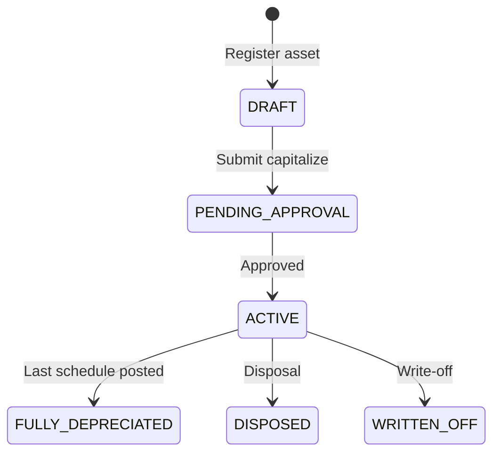

# 12. Fixed Asset — Aset Tetap dan Amortisasi

Modul Fixed Asset menangani **aset berwujud**, **aset tidak berwujud**, **prepaid expense**, dan **amortisasi** — terintegrasi GL.

Legacy: FE partial (`modules/fixedAsset/pages/depreciation`); **belum ada model Prisma** — modul **baru** di rebuild.

---

## 12.1 Scope

| Kategori | Contoh | Metode |
|----------|--------|--------|
| **Tangible (berwujud)** | Mesin, kendaraan, furniture | Depresiasi garis lurus / saldo menurun |
| **Intangible (tidak berwujud)** | Lisensi software, hak paten, goodwill | Amortisasi |
| **Prepaid / deferred** | Sewa dibayar di muka, asuransi prepayment | Amortisasi prepaid over benefit period |
| **Low-value asset** | Di bawah threshold | Expense langsung (kebijakan company) |

---

## 12.2 Model data (usulan)

```prisma
enum AssetCategory {
  TANGIBLE
  INTANGIBLE
  PREPAID
}

enum AssetStatus {
  DRAFT
  ACTIVE
  FULLY_DEPRECIATED
  DISPOSED
  WRITTEN_OFF
}

model FixedAsset {
  id              String        @id @default(uuid())
  companyId       String
  assetNumber     String
  name            String
  category        AssetCategory
  acquisitionDate DateTime
  inServiceDate   DateTime
  currencyCode    String
  acquisitionCost Decimal
  acquisitionCostBase Decimal
  residualValue   Decimal       @default(0)
  usefulLifeMonths Int
  depreciationMethod DepreciationMethod @default(STRAIGHT_LINE)
  status          AssetStatus   @default(DRAFT)
  coaAssetId      String        // COA UUID
  coaDepreciationId String
  coaAccumDepId   String
  locationId      String?       // warehouse / branch location
  serialNumber    String?
  ...
  @@unique([companyId, assetNumber])
}

model DepreciationSchedule {
  id            String   @id @default(uuid())
  fixedAssetId  String
  periodYear    Int
  periodMonth   Int
  amount        Decimal
  amountBase    Decimal
  isPosted      Boolean  @default(false)
  glJournalId   String?
  ...
}

model AssetDisposal {
  id            String   @id @default(uuid())
  fixedAssetId  String
  disposalDate  DateTime
  proceeds      Decimal?
  gainLoss      Decimal
  glJournalId   String?
  ...
}
```

---

## 12.3 Lifecycle



Capitalization approval via **Approval Engine** (`entityType = FIXED_ASSET`).

---

## 12.4 Depresiasi / amortisasi

### Straight-line (default)

```
monthlyDepreciation = (acquisitionCost - residualValue) / usefulLifeMonths
```

### Prepaid amortization

- `benefitStartDate` → `benefitEndDate`
- Equal monthly charge over benefit period
- Initial recognition: Dr Prepaid asset, Cr Bank/AP

### Run bulanan

Background job `DepreciationRunJob`:

1. Select ACTIVE assets with unposted schedule for period
2. Generate `DepreciationSchedule` lines
3. Post GL journal per asset (batch optional)
4. Mark schedule posted

### Jurnal contoh — depresiasi bulanan

| COA | Dr base | Cr base |
|-----|---------|---------|
| Beban depresiasi | 1.000.000 | — |
| Akumulasi depresiasi | — | 1.000.000 |

---

## 12.5 Multi-currency

| Event | Currency handling |
|-------|-------------------|
| Acquisition | Store txn currency + base at acquisition rate |
| Depreciation | Always in **base currency** |
| Revaluation (fase 2) | IFRS optional — adjust NBV |

---

## 12.6 Multi cabang

- Asset scoped `companyId`
- Transfer antar cabang: disposal cabang A + acquisition cabang B (inter-company fase 2)
- v1: manual dispose + re-register

---

## 12.7 Integrasi modul

| Modul | Integrasi |
|-------|-----------|
| Purchasing | Asset from PO capitalization link |
| GL | All depreciation/disposal journals |
| Approval | Capitalize above threshold |
| Fixed location | Link to warehouse/branch |
| Tax | Fiscal depreciation book vs commercial (fase 2) |

---

## 12.8 UI (Next.js)

| Route | Fungsi |
|-------|--------|
| `/fixed-asset/register` | Asset register list |
| `/fixed-asset/register/:id` | Detail + schedule |
| `/fixed-asset/depreciation/run` | Monthly run wizard |
| `/fixed-asset/disposal` | Disposal form |
| `/fixed-asset/reports` | Asset listing, NBV, movement |

Port halaman depreciation legacy sebagai referensi UX.

---

## 12.9 Acceptance criteria

1. Tangible asset capitalized → monthly depreciation posts for 60 months.
2. Prepaid 12-month insurance → amortization 1/12 per month.
3. Intangible license → amortized over useful life.
4. Disposal with proceeds → gain/loss journal correct.
5. Depreciation blocked in closed period.
6. Asset register NBV = GL asset account - accumulated depreciation.
