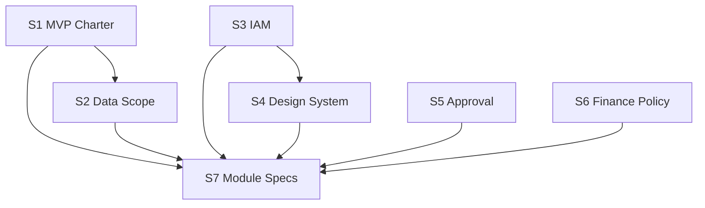

# Agenda Pembahasan & Status Freeze

Dokumen ini menjadi **checklist live** topik pra-coding: apa yang sudah dibahas, sampai mana, dan kapan topic di-**freeze**.

**Terakhir diperbarui:** 2026-07-24  
**Fokus aktif saat ini:** **S4 — Design System Brief**

---

## Cara pakai

1. Setiap sesi, update kolom **Progress** dan **Catatan singkat**.
2. Topic **tidak di-freeze** selama status `SEDANG_DIBAHAS` — masih boleh revisi sampai **Exit criteria** tercentang.
3. Setelah exit criteria terpenuhi, ubah status ke **`FREEZE`**; perubahan hanya lewat **`AMENDMENT`** (catat di `docs/decisions/`).
4. Coding modul/UI **tidak dimulai** untuk area yang bergantung topic yang belum `FREEZE` (lihat tabel dependensi).

---

## Aturan freeze vs lanjut

| Status | Arti | Boleh ubah? |
|--------|------|-------------|
| `BELUM_DIMULAI` | Belum workshop / belum draft | — |
| `REFERENSI` | Ada dokumen awal (brainstorm), **bukan** keputusan final | Bebas edit dokumen |
| `SEDANG_DIBAHAS` | Sedang aktif dibahas | Ya, sampai exit criteria terpenuhi |
| `FREEZE` | Keputusan disepakati stakeholder | Tidak, kecuali amendment |
| `AMENDMENT` | Freeze dibuka untuk perubahan terkontrol | Hanya scope amendment |

**Prinsip:** Freeze = **exit criteria checklist 100%** + minimal **1 stakeholder sign-off** (nama + tanggal di dokumen terkait).

---

## Daftar agenda (urutan disarankan)

| ID | Topik | Dokumen utama | Status | Exit criteria (ringkas) | Freeze? |
|----|-------|---------------|--------|-------------------------|---------|
| **S0** | Perencanaan awal (modul, arsitektur, roadmap) | `docs/01`–`12` | `REFERENSI` | — (referensi, bukan charter MVP) | Tidak perlu freeze |
| **S1** | Product charter & batas MVP | `docs/decisions/MVP_SCOPE.md` *(belum)* | `BELUM_DIMULAI` | Scope in/out, 5–10 skenario UAT v1, persona v1 | ⏳ |
| **S2** | Tenancy, cabang, data scope | `docs/policies/DATA_SCOPE.md` *(belum)* | `BELUM_DIMULAI` | Matriks entity × scope (group/company/global) | ⏳ |
| **S3** | IAM & permission matrix | `docs/policies/IAM_PERMISSIONS.md` *(belum)* | `BELUM_DIMULAI` | Role seed + format permission + matrix v1 | ⏳ |
| **S4** | **Design system & UX platform** | [`design-system/DESIGN_SYSTEM_BRIEF.md`](./design-system/DESIGN_SYSTEM_BRIEF.md) | **`SEDANG_DIBAHAS`** | Brief v1 + pola ERP + 2 halaman referensi (wireframe) | ⏳ |
| **S5** | Approval & risk registry | `docs/policies/APPROVAL_REGISTRY.md` *(belum)* | `BELUM_DIMULAI` | entityType v1, trigger, 3 contoh workflow | ⏳ |
| **S6** | Finance & multi-currency policy | `docs/policies/FINANCE_POLICY.md` *(belum)* | `BELUM_DIMULAI` | Kurs, posting, period close, skenario jurnal v1 | ⏳ |
| **S7** | Spesifikasi modul (per modul) | `docs/modules/*.md` *(belum)* | `BELUM_DIMULAI` | Module spec FREEZE per modul (urutan dependency) | ⏳ per modul |
| **S8** | Industry profile (IMPA/ATA) | `09-INDUSTRY_PROFILES.md` + policy | `BELUM_DIMULAI` | Profile matrix + 1 journey/industri (jika masuk MVP) | ⏳ |

**Legenda Freeze:** ⏳ belum · 🔒 sudah freeze

---

## Dependensi (apa harus freeze dulu)



| Aktivitas | Minimal harus FREEZE |
|-----------|----------------------|
| Mockup / Figma modul operasional | **S4** (+ **S3** untuk tombol aksi) |
| Module spec Inventory / Sales | **S1, S2, S5, S6** + **S4** pola dokumen |
| Implementasi UI komponen shared | **S4** |
| Implementasi API | **S7** modul terkait + policy terkait |

**Catatan:** **S4 Design System** bisa dibahas **paralel** dengan S1–S3, tetapi **freeze S4** sebaiknya setelah keputusan UI kit & bahasa UI; freeze **module spec** tetap menunggu S1/S2/S6 sesuai modul.

---

## Checkpoint — pembahasan sampai mana

### Selesai (referensi)

- [x] Inventaris proyek legacy & katalog modul (`docs/02`, `04`, `11`)
- [x] Arsitektur target high-level (`docs/03`, `10`)
- [x] Domain design draft (finance, branch, approval, mfg, industry, FA)

### Sedang berjalan — **S4 Design System Brief**

- [x] Dokumen brief dibuat (`design-system/DESIGN_SYSTEM_BRIEF.md`)
- [ ] **Keputusan:** UI library tunggal (rekomendasi: Ant Design 6)
- [ ] **Keputusan:** Bahasa UI (ID / EN / bilingual)
- [ ] **Keputusan:** Dark mode v1 ya/tidak
- [ ] Token warna & typography (brand + status dokumen)
- [ ] Pola status dokumen ERP (Draft → Posted)
- [ ] Daftar komponen/pola wajib platform
- [ ] 2 halaman referensi: **List transaksi** + **Detail dokumen + approval tab**
- [ ] Sign-off → ubah S4 ke **FREEZE**

### Belum dimulai (antrian)

- [ ] S1 Product charter MVP
- [ ] S2 Data scope cabang
- [ ] S3 IAM permission matrix
- [ ] S5 Approval registry
- [ ] S6 Finance policy
- [ ] S7 Module spec (Settings → …)
- [ ] S8 Industry profile (jika MVP)

---

## Log sesi (isi setiap meeting)

| Tanggal | ID | Peserta | Ringkasan | Follow-up |
|---------|-----|---------|-----------|-----------|
| 2026-07-24 | S4 | — | Brief design system dibuat; status SEDANG_DIBAHAS; menunggu keputusan UI kit, bahasa, token, wireframe referensi | Workshop S4: putuskan item checklist checkpoint |

---

## Template sign-off freeze

Salin ke dokumen topic saat freeze:

```markdown
## Sign-off FREEZE
- Topic ID: S4
- Tanggal freeze: YYYY-MM-DD
- Disetujui oleh: [nama, peran]
- Versi dokumen: v1.0
- Amendment: buka tiket di docs/decisions/ADR-XXX.md
```

---

## Pertanyaan untuk sesi berikutnya (S4)

1. Apakah **Ant Design 6** disetujui sebagai satu-satunya UI kit (tanpa MUI)?
2. Bahasa antarmuka v1: **Indonesia saja** atau bilingual?
3. Dark mode masuk v1 atau ditunda?
4. Warna brand ACT Strive (hex) — ada guideline logo?
5. Wireframe referensi: siapa yang buat (desainer internal / developer dengan template)?

Setelah jawab 1–5 dan checklist checkpoint S4 centang, topic S4 bisa **FREEZE** dan kita lanjut **S1** atau **S3** sesuai prioritas Anda.
